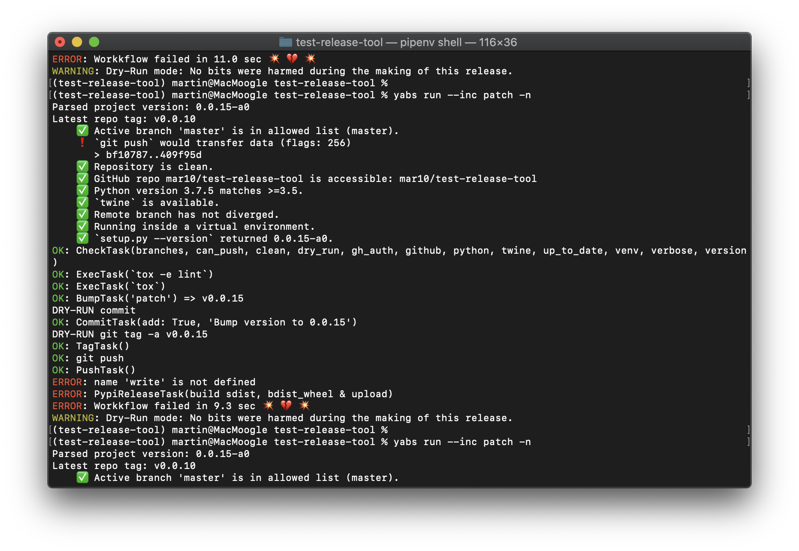

.. _main-index:

####
Yabs
####

*Test, Build, Deliver!*

|travis_badge| |nbsp| |pypi_badge| |nbsp| |lic_badge| |nbsp| |rtd_badge| |nbsp|
|coverage_badge| |nbsp| |black_badge| |nbsp| |so_badge|

:Project:   https://github.com/mar10/yabs/
:Version:   |version|, Date: |today|

.. warning::
  Yabs has currently *beta* status.

.. toctree::
   :hidden:

   Overview<self>
   installation
   user_guide.md
   reference_guide
   development
   changes

Features
========

  * This is a command line tool...
  * ... and a library for use in custom Python projects.
  * The command line tool runs on Linux, macOS, and Windows.

Quickstart
==========

Releases are hosted on `PyPI <https://pypi.python.org/pypi/yabs>`_ and can
be installed using `pipenv <https://pipenv.pypa.io/>`_
(`Python 3.5+ <https://www.python.org/downloads/>`_ is required) ::

  $ pipenv shell
  (yabs) $ pipenv install yabs --upgrade
  (yabs) $ yabs --version -v
  (yabs) $ yabs --help
  (yabs) $ yabs run patch

..
  Indices and tables
  ==================

  * :ref:`genindex`
  * :ref:`modindex`
  * :ref:`search`

.. |travis_badge| image:: https://travis-ci.org/mar10/yabs.svg?branch=master
   :alt: Build Status
   :target: https://travis-ci.org/mar10/yabs

.. |pypi_badge| image:: https://img.shields.io/pypi/v/yabs.svg
   :alt: PyPI Version
   :target: https://pypi.python.org/pypi/yabs/

.. |lic_badge| image:: https://img.shields.io/pypi/l/yabs.svg
   :alt: License
   :target: https://github.com/mar10/yabs/blob/master/LICENSE.txt

.. |rtd_badge| image:: https://readthedocs.org/projects/yabs/badge/?version=latest
   :target: https://yabs.readthedocs.io/
   :alt: Documentation Status

.. |coverage_badge| image:: https://coveralls.io/repos/github/mar10/yabs/badge.svg?branch=master
   :target: https://coveralls.io/github/mar10/yabs?branch=master
   :alt: Coverage Status

.. |black_badge| image:: https://img.shields.io/badge/code%20style-black-000000.svg
   :target: https://github.com/ambv/black
   :alt: Code style: black

.. |so_badge| image:: https://img.shields.io/badge/StackOverflow-yabs-blue.svg
   :target: https://stackoverflow.com/questions/tagged/yabs
   :alt: StackOverflow: yabs

